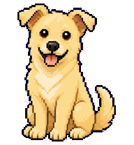
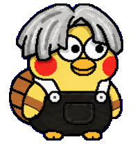
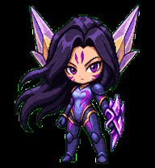
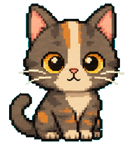
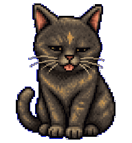

# Codex Pets

这是一个给 Codex 桌面宠物用的 pet 素材仓库。每个子目录都是一只独立的宠物，包含：

- `pet.json`: 宠物元数据，包括 `id`、展示名、描述和 spritesheet 路径
- `spritesheet.webp`: 宠物动画素材

## 怎么用

把这个仓库放在 Codex pets 目录下即可：

```bash
git clone git@github.com:guguji666666/codex-pets.git ~/.codex/pets
```

目录结构示例：

```text
~/.codex/pets/
  cookie/
    pet.json
    spritesheet.webp
  mimi/
    pet.json
    spritesheet.webp
```

添加新宠物时，新建一个目录，并放入对应的 `pet.json` 和 `spritesheet.webp`。`pet.json` 里的 `spritesheetPath` 通常保持为 `spritesheet.webp`。

## Pets

| Pet | Preview |
| --- | --- |
| Amadeus Kurisu |  |
| 爱弥斯 / Ameath |  |
| Cookie |  |
| ikkun |  |
| 鸡哥ikun |  |
| 鸡哥ikun Pet |  |
| Kai'Sa |  |
| Kratos |  |
| Kratos Custom |  |
| Lucky |  |
| Mimi |  |
